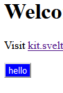
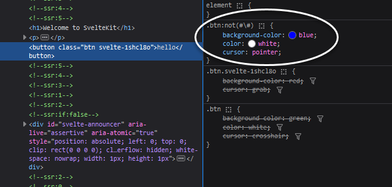
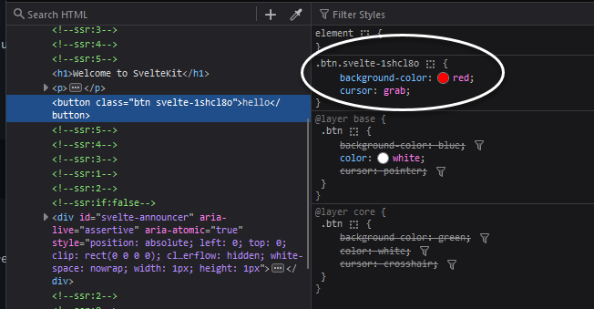

# The blue button should be red...

## steps taken to create this project

```bash

# create a new project in my-app
npm create svelte@latest pcssverify
cd pcssverify
npx svelte-add@latest postcss --postcss-autoprefixer
pnpm install
pnpm add -D @csstools/postcss-cascade-layers
```

Added `postcssCascadeLayers` to the postcss.config.js file

```javascript
const autoprefixer = require("autoprefixer");
const postcssCascadeLayers = require('@csstools/postcss-cascade-layers');

const config = {
  plugins: [
    autoprefixer,
    postcssCascadeLayers()
  ],
};
```

## There are three files involved...

### 1. src/routes/+page.svelte
This file ought to "win" the background color, since both other definitions are in `@layer`s.
```html
<button class="btn">hello</button>

<style lang=postcss>
  .btn {
    background-color: red;
    cursor: grab;
  }
</style>
```

### 2. src/app.pcss

```css
@import 'src/css/index.css';

@layer base {
    .btn {
        background-color: blue;
        color: white;
        cursor: pointer;
    }
}
```

### 3. src/css/index.css

```css
@layer core {
    .btn {
        background-color: green;
        color: white;
        cursor: crosshair;
    }
}
```

## The result is...



where the app.pcss style is winning:


### The expected result is...

If I remove `postcssCascadeLayers` from the postcss.config.js file, I get the expected result:


